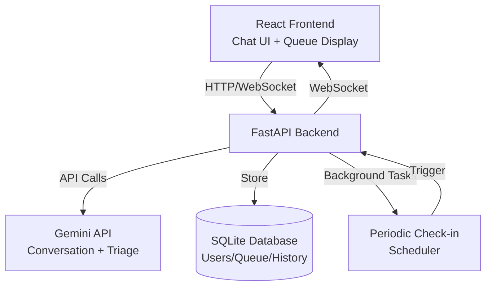

# MediQueue Conversational AI Triage System - Implementation Plan

## Architecture Overview




## Tech Stack

- **Frontend**: React + Vite (fast setup, modern UI)
- **Backend**: Python + FastAPI (async support, WebSocket, Gemini integration)
- **AI**: Google Gemini API (conversational triage)
- **Database**: SQLite (simple, no external dependencies)
- **Real-time**: WebSockets (FastAPI native support)
- **Background Tasks**: APScheduler (for periodic check-ins)

## Project Structure

```javascript
mediqueue/
├── backend/
│   ├── app/
│   │   ├── __init__.py
│   │   ├── main.py              # FastAPI app, WebSocket endpoints
│   │   ├── models.py            # SQLite models (User, QueueEntry, History)
│   │   ├── gemini_service.py    # Gemini API integration
│   │   ├── queue_manager.py     # Queue logic (severity + wait time)
│   │   ├── triage_logic.py      # Severity scoring, priority assignment
│   │   └── scheduler.py         # Periodic check-in background tasks
│   ├── requirements.txt
│   └── database.db              # SQLite database
├── frontend/
│   ├── src/
│   │   ├── App.jsx              # Main app component
│   │   ├── components/
│   │   │   ├── ChatInterface.jsx    # Conversation UI
│   │   │   ├── QueueDisplay.jsx     # Real-time queue view
│   │   │   └── CheckInModal.jsx      # Periodic check-in popup
│   │   ├── services/
│   │   │   ├── api.js           # HTTP API calls
│   │   │   └── websocket.js     # WebSocket connection
│   │   └── main.jsx
│   ├── package.json
│   └── vite.config.js
├── README.md
└── .env.example                 # Gemini API key template
```


## Core Features Implementation

### 1. Database Models (`backend/app/models.py`)

- **User**: id, session_id, name, phone, misuse_count, created_at
- **QueueEntry**: id, user_id, severity_score, priority_level, wait_time, position, status, created_at
- **ConversationHistory**: id, user_id, messages (JSON), triage_result, timestamp
- **CheckInLog**: id, user_id, queue_entry_id, response, timestamp

### 2. Gemini Integration (`backend/app/gemini_service.py`)

- **Conversation Handler**: Multi-turn conversation for symptom collection
- **Severity Analyzer**: Extract severity score (1-10) from conversation
- **Home Guidance Generator**: Provide first-aid/home care advice
- **Misuse Detection**: Flag suspicious patterns in responses

Key prompt structure:

- System prompt: Role as triage assistant, extract severity, provide guidance
- Conversation context: Previous messages, user history
- Output format: Structured JSON (severity, guidance, emergency_flag)

### 3. Queue Management (`backend/app/queue_manager.py`)

**Priority Calculation Formula**:

```javascript
priority_score = (severity_weight * severity_score) + (wait_weight * normalized_wait_time)
```

- severity_weight: 0.7 (medical urgency)
- wait_weight: 0.3 (fairness)
- Normalize wait_time: (current_time - entry_time) / max_wait_threshold

**Queue Operations**:

- `add_to_queue(user_id, severity_score)` → Calculate priority, insert sorted
- `update_positions()` → Recalculate all positions based on priority
- `remove_from_queue(user_id)` → Remove entry, update positions
- `get_queue_position(user_id)` → Return current position
- `lower_position(user_id)` → User-initiated position decrease

### 4. Triage Logic (`backend/app/triage_logic.py`)

- **Severity Levels**: 
- Critical (9-10): Immediate ER
- High (7-8): Urgent care within 1 hour
- Medium (4-6): Appointment within 24 hours
- Low (1-3): Self-care guidance
- **Emergency Detection**: Keywords + Gemini analysis (chest pain, difficulty breathing, etc.)
- **Misuse Tracking**: Compare reported severity vs. actual symptoms, flag inconsistencies

### 5. Real-time Updates (`backend/app/main.py`)

**WebSocket Endpoints**:

- `/ws/{session_id}`: Real-time queue position updates
- Broadcast queue changes to all connected clients
- Send periodic check-in prompts

**HTTP Endpoints**:

- `POST /api/start-triage`: Begin conversation, create user session
- `POST /api/message`: Send message to Gemini, get response
- `POST /api/complete-triage`: Finalize triage, add to queue
- `GET /api/queue`: Get current queue state
- `POST /api/lower-position`: User-initiated position change
- `POST /api/check-in-response`: Respond to periodic check-in

### 6. Periodic Check-ins (`backend/app/scheduler.py`)

- Use APScheduler to run background tasks
- Every 30 minutes: Check active queue entries
- Send WebSocket message to frontend → Show check-in modal
- If no response after 5 minutes: Escalate or mark as stable
- Update queue if condition worsens

### 7. Frontend Components

**ChatInterface.jsx**:

- Message bubbles (user/AI)
- Input field with send button
- Loading states during Gemini API calls
- Show severity assessment when triage completes

**QueueDisplay.jsx**:

- Real-time queue list (position, severity, wait time)
- Visual indicators (color-coded by severity)
- "Lower my position" button
- Estimated wait time display

**CheckInModal.jsx**:

- Popup triggered by WebSocket message
- "How are you feeling?" question
- Options: Better/Same/Worse
- Auto-submit response

## Implementation Steps

### Phase 1: Setup & Core Infrastructure (1-2 hours)

1. Initialize project structure
2. Set up FastAPI backend with basic endpoints
3. Set up React frontend with Vite
4. Create SQLite database models
5. Configure Gemini API client

### Phase 2: Conversation & Triage (2-3 hours)

1. Implement Gemini conversation handler
2. Build chat UI component
3. Create severity extraction logic
4. Add home guidance generation
5. Test conversation flow end-to-end

### Phase 3: Queue Management (2 hours)

1. Implement priority calculation algorithm
2. Build queue manager with add/remove/update operations
3. Create queue display component
4. Add user-initiated position lowering
5. Test queue dynamics

### Phase 4: Real-time & Check-ins (2 hours)

1. Set up WebSocket connection
2. Implement real-time queue updates
3. Add periodic check-in scheduler
4. Build check-in modal component
5. Test real-time features

### Phase 5: Polish & Demo Prep (1 hour)

1. Add misuse tracking logic
2. Improve UI/UX styling
3. Add error handling
4. Create demo script/scenarios
5. Test full flow

## Key Files to Create

1. `backend/app/main.py` - FastAPI app, routes, WebSocket handlers
2. `backend/app/gemini_service.py` - Gemini API wrapper, conversation logic
3. `backend/app/queue_manager.py` - Queue priority algorithm, position management
4. `backend/app/models.py` - SQLite ORM models
5. `backend/app/scheduler.py` - APScheduler setup for check-ins
6. `frontend/src/components/ChatInterface.jsx` - Main conversation UI
7. `frontend/src/components/QueueDisplay.jsx` - Real-time queue visualization
8. `frontend/src/services/websocket.js` - WebSocket client connection

## Demo Scenarios

1. **Normal Triage**: User with moderate symptoms → Gets priority, sees queue position
2. **Emergency Case**: User reports chest pain → Immediate escalation, high priority
3. **Queue Dynamics**: Show how position changes as others join/leave
4. **Periodic Check-in**: Simulate 30-minute check-in popup
5. **Position Lowering**: User voluntarily moves down queue
6. **Misuse Detection**: Show warning for inconsistent reporting

## Environment Variables Needed

- `GEMINI_API_KEY`: Your Google Gemini API key
- `DATABASE_URL`: SQLite file path (optional, defaults to `database.db`)

## Dependencies

**Backend** (`requirements.txt`):

- fastapi
- uvicorn[standard]
- google-generativeai
- sqlalchemy
- apscheduler
- python-dotenv
- websockets

**Frontend** (`package.json`):

- react
- react-dom
- vite
- axios (for HTTP requests)
- reconnecting-websocket (for WebSocket)

## Notes for 8-Hour Timeline

- Focus on core triage + queue functionality first
- Simplify UI styling if time is tight (use basic CSS/Tailwind)
- Mock some features if needed (e.g., simplified misuse detection)
- Prioritize working demo over perfect code

